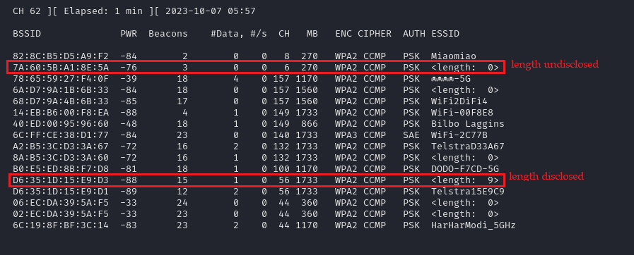

# ssid-demasker
A simple utility that allows for hidden SSID to be demasked using SSID wordlists generated with hashcat. 

The following illistrates the scenarios where a hidden SSID's length is disclosed by the access point (AP) and when it's not, using [`airodump-ng`](https://github.com/aircrack-ng/aircrack-ng). 


## Usage

```
usage: ssid-demasker.py [-h] [-w WORDLIST_FILE] -i INTERFACE [-r COUNT] -m {1,2} [--increment] [--fixed FIXED] [--min MIN] [--max MAX] [--mask MASK]

Automated tool for extract the public key presented by WPA2-Enterprise wireless networks

options:
  -h, --help            show this help message and exit
  -w WORDLIST_FILE, --wordlist WORDLIST_FILE
                        Specify wordlist containing SSID values to test. (Default: ssid.lst)
  -i INTERFACE, --interface INTERFACE
                        Specify used to broadcast packets
  -r COUNT, --resend COUNT
                        Specify how many times each SSID should be sent to account for transmission issues. (Default: 1)
  -m {1,2}, --mode {1,2}
                        Specify where to use a pre-generated wordlist (1), or generate a wordlist at runtime (0). (Default: 1)

  Specify control for just in time wordlist generation

  --increment           Enable incremental loops
  --fixed FIXED         Control the mask length when not using incremental loops
  --min MIN             Set the floor of the incremental loop. (Default: 1)
  --max MAX             Set the upper boundary of the incremental loop.
  --mask MASK           Specify the mask to use, do Not include the full mask as the specified value will be multiplied by the --fixed or each incremental loop. (Default: ?l?u?d)
```

### Pre-computed SSID list

```bash
# Pre-computed SSID list
hashcat -a 3 -i -1 ?u?l?d?s {?1 * max length} --increment-min {min length} --increment-min {max length} --quiet --stdout >> ssid.lst
hashcat -a 3 -1 ?u?l?d?s {?1 * length} --quiet --stdout >> ssid.lst

# Transmission
sudo nmcli dev set {wlan interface} managed no
sudo iwconfig {wlan interface} mode monitor
sudo python3 ssid-demasker.py -i {wlan interface} -m 1 -w ssid.lst

# Wireshark display filter
wlan.fc.type eq 0 and wlan.fc.subtype eq 5
```

### SSID list generated at runtime

```bash
# Transmission
sudo nmcli dev set {wlan interface} managed no
sudo iwconfig {wlan interface} mode monitor

# Fixed length
sudo python3 ssid-demasker.py -i {wlan interface} --mode 2 --fixed {fixed ssid length}

# Incremental loop
sudo python3 ssid-demasker.py -i {wlan interface} --mode 2 --increment --min {min length} --max {max length}

# Wireshark display filter
wlan.fc.type eq 0 and wlan.fc.subtype eq 5
```
